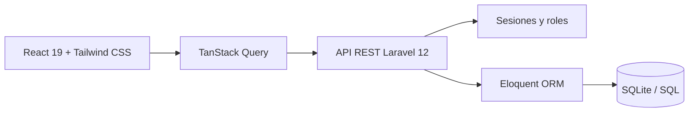

# JoDev CRM

CRM full stack para centralizar clientes, contactos, oportunidades, tareas y actividad comercial en una interfaz clara y adaptable.


## Qué ofrece

- Panel con indicadores y resumen de la actividad comercial.
- Gestión de clientes, contactos y oportunidades.
- Seguimiento de tareas y actividades con usuarios asignados.
- Búsqueda global entre las principales entidades del CRM.
- Roles de administrador y cliente con vistas diferenciadas.
- Preferencias visuales persistentes por usuario.
- API REST protegida mediante sesión y autenticación de Laravel.
- Diseño responsive construido con React y Tailwind CSS.

## Arquitectura



El backend organiza la lógica HTTP en controladores API y modelos Eloquent. El frontend consume esos endpoints mediante Axios y TanStack Query, mientras React Router gestiona la navegación de la aplicación.

## Tecnologías

| Área | Tecnologías |
| --- | --- |
| Backend | PHP 8.2+, Laravel 12, Eloquent |
| Frontend | React 19, React Router 7, TanStack Query 5 |
| Interfaz | Tailwind CSS 4, Vite 6 |
| Persistencia | SQLite por defecto; compatible con los motores soportados por Laravel |
| Calidad | PHPUnit 11, Vitest, Testing Library, Laravel Pint |

## Puesta en marcha

### Requisitos

- PHP 8.2 o superior con la extensión SQLite habilitada.
- Composer.
- Node.js y npm.

### Instalación

```bash
git clone https://github.com/Jacketring/JoDev.git
cd JoDev
composer install
cp .env.example .env
php artisan key:generate
```

Crea la base SQLite, ejecuta las migraciones y carga los datos de demostración:

```bash
touch database/database.sqlite
php artisan migrate --seed
npm install
```

En Windows PowerShell puedes crear la base con:

```powershell
New-Item database/database.sqlite -ItemType File -Force
```

Arranca backend y frontend:

```bash
composer run dev
```

La aplicación quedará disponible en `http://localhost:8000`.

## Acceso de demostración

Después de ejecutar los seeders:

| Perfil | Correo | Contraseña |
| --- | --- | --- |
| Administrador | `admin@jodev.es` | `JoDev2026!` |
| Cliente | `cliente@jodev.es` | `Cliente2026!` |

Estas credenciales son exclusivamente datos locales de demostración. Deben sustituirse en cualquier despliegue real.

## Pruebas

```bash
php artisan test
npm run test:frontend
```

El proyecto incluye pruebas de autenticación, permisos, clientes, entidades del CRM, dashboard, búsqueda global y preferencias visuales, además de pruebas de componentes React.

## Estructura principal

```text
app/Http/Controllers/Api/   Endpoints REST
app/Models/                 Entidades Eloquent
database/migrations/        Esquema de datos
database/seeders/           Datos de demostración
resources/js/               Aplicación React
routes/api.php              Rutas de la API
tests/                      Pruebas del backend
```

## Autor

Desarrollado por [José Hurtado de Mendoza Suárez](https://josehurtado.dev).
